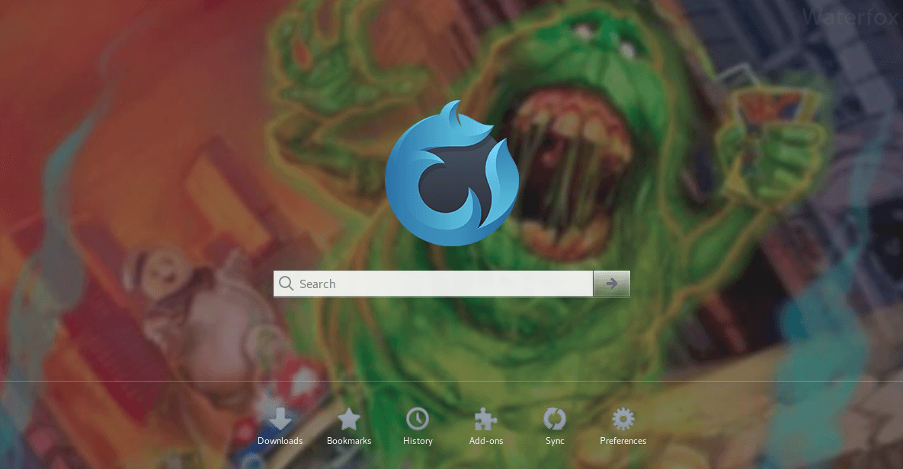

# Configuration files
Archive of configuration files I regularly use across multiple systems

Atom colored bracket matcher CSS:

.bashrc git branch display in active terminal:

Waterfox launch page:

Ghostbusters art by Devon Whitehead
