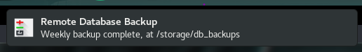

# Configurations &amp; Customizations
Archive of configuration files &amp; customizations I regularly use across multiple systems.

### Automated Git Notifications for Remote Backups

Reject the automated pull if a VPN session is detected:

Find this on the [crontab](blob/master/sysadmin/crons)

***

### Atom
Atom colored bracket matcher CSS:

Also part of [Ghoulish UI theme for Atom](https://github.com/angela-d/ghoulish-ui), which is also where most of my UI modifications now go, instead of custom CSS.
***
### Bash
.bashrc git branch display in active terminal:

Prompt colorization and git branch details.
***
### Waterfox
Waterfox launch page wallpaper:

Art by [Frostwindz](https://frostwindz.deviantart.com/art/Halloween-2014-489048562)

Home page wallpaper background and CSS customizations to make it less bland.

Waterfox new tab wallpaper:

Art by [sabin-boykinov](https://www.deviantart.com/art/Halloween-harvest-335274322)

Visited page box shadows, new tab page wallpaper &amp; matching search input with semi-transparent background.

***
### Firefox ESR 60 Fixes to Restore old New Tab / about:home / about:tab Page

- Restores the classic new tab layout page in pure CSS, *without an extension* needed!
- Restore the original visited pages thumbnail size, from the new tiny squares to the old rectangle boxes
- Rid the Firefox branding in the corner
- Auto-adjusting layout independent of static screen resolution
- Status bar reclaimed after the Status 4 Evar extension became deprecated, thanks to [MatMoul](https://github.com/MatMoul/firefox-gui-chrome-css)
- Restore the rounded tabs, thanks to [wilfredwee](https://github.com/wilfredwee/photon-australis)
- Restore logo, except more theme-fitting this time; instead of the Firefox logo. Cauldron clipart from [Rocket Theme](http://www.rockettheme.com/)
- Halloween background art by Art by [Frostwindz](https://frostwindz.deviantart.com/art/Halloween-2014-489048562)

Looks just as cool without the visited page boxes :)

### GTK Dark Theme
Qogir-dark customizations:

GTK theme [Qogir-dark](https://github.com/vinceliuice/Qogir-theme), Evil Dead art by Devon Whitehead

Nautilus left-panel and header bar transparency, action colors switched from blue to dark purple and Nautilus logo + background.
