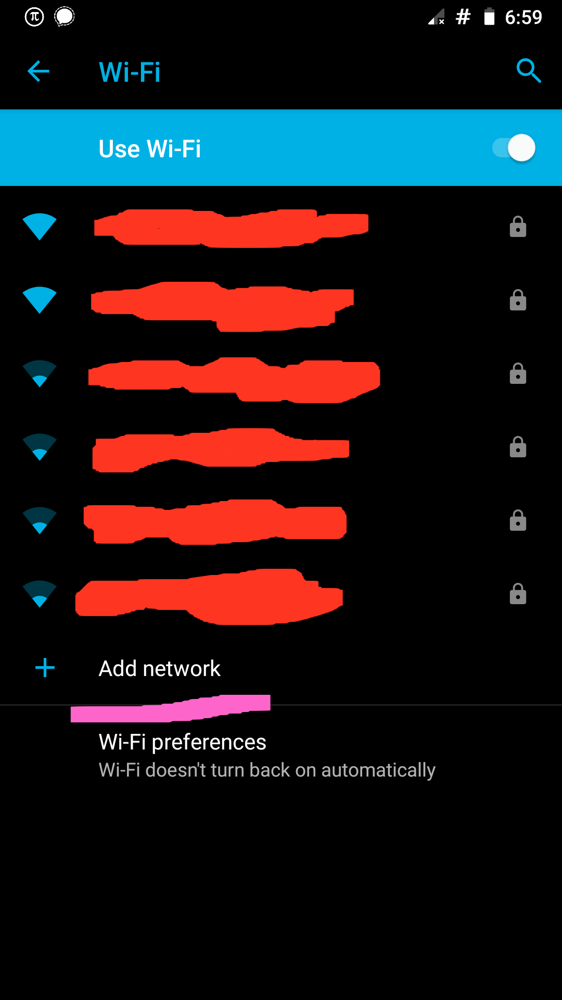
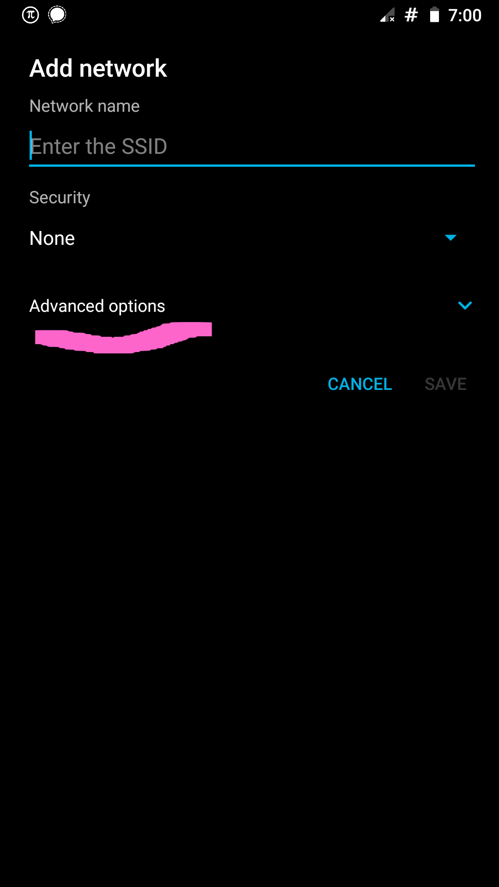
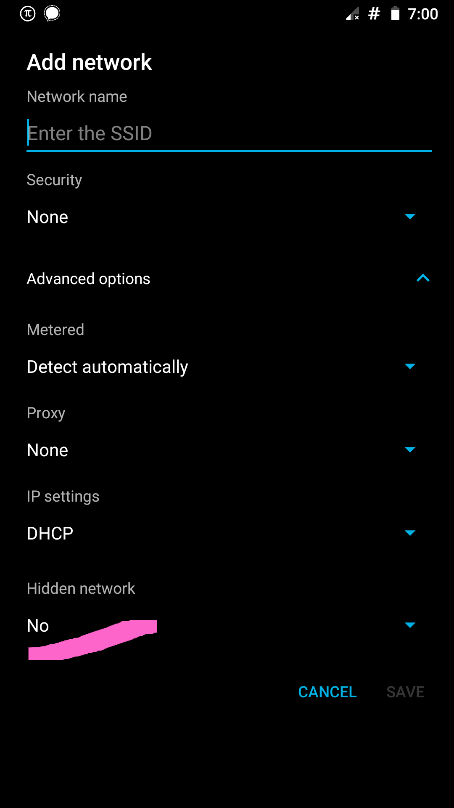
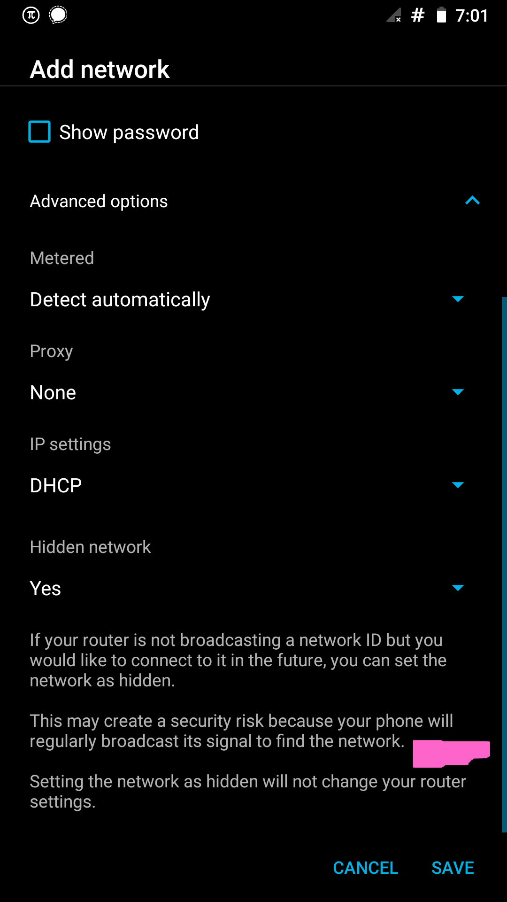

# Not Connecting to Hidden Wifi SSIDs

This is a "feature" of Android 9 Pie / Lineage 16 and not related specifically to Oneplus.  The phone doesn't connect to hidden SSIDs by default, like previous Android/Lineage versions.

The obligatory "hiding your SSID is security through obscurity which is no security at all." - So what?  It will at least slow down unskilled neighborhood script kiddies and you're less likely to have your SSID hoovered by the Google cars that survey neighborhoods.

This is the "fix" to allow connections to hidden SSIDs - note that I could not find this setting in previously saved SSIDs, so I had to "forget" the SSID I wanted to hide, first:

- Settings > Network & Internet > Wi-Fi
- Connect to your network:

- Go to Advanced Options

- Now the hidden SSID option is exposed - toggle it to 'Yes'

- Note that there's an ominous warning, which you should definitely heed; but its also poor security/privacy practice to leave wifi on when you aren't at home (stores use wifi/bluetooth beacons to track customers).  Surely nobody connects to untrusted wifi networks while out and about, right??

> This may create a security risk because your phone will regularly broadcast its signal to find the network.

Just switch wifi (and Bluetooth) off when you're not in range of a trusted network.
