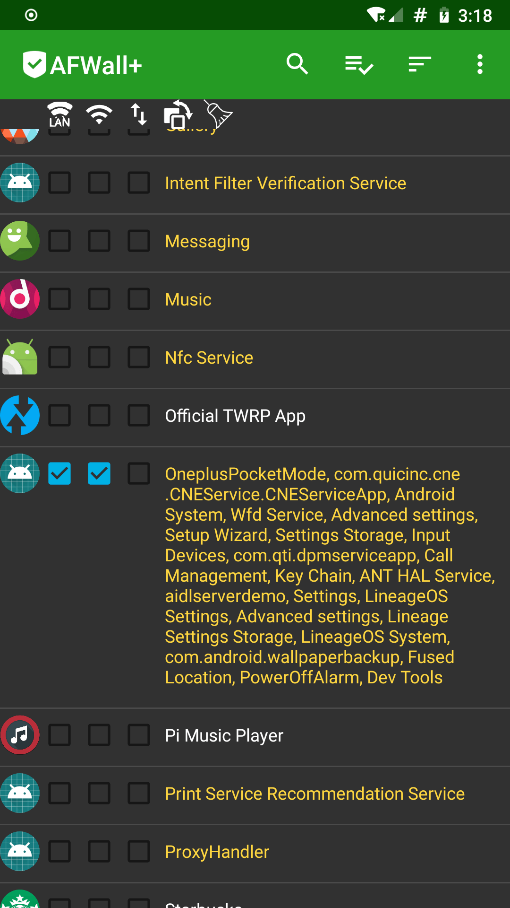

# Wifi No Internet on Android 9 / Lineage 16
On Android 7 / Lineage 14 I had a recurring issue where if I took the phone off airplane mode or switched networks, I'd get an x over the wifi saying no internet.. but it would always work anyway.  However, if mobile data was also switched on, it would default to that - indicating a deeper issue.

It was easy enough to turn off mobile data when using wifi, never had further issues.

On Android 9 / Lineage 16 that seems to not be the case.  Everything works, except for Signal to Signal messages (vanilla SMS work, but MMS or messages to other Signal app users do not, unless the phone is reboot).

Thanks to [this post](https://github.com/ukanth/afwall/issues/761) on AFWall's Github issues, I was able to get it resolved.  I'll duplicate the fixes in my notes incase the AFWall repo/post ever gets moved or migrated to another host.

## Tools Needed
- Rooted phone
- USB from your PC to phone
- Debug mode enabled on the phone
- ADB / Android Debug Bridge installed on the PC
- Wireshark (if you want to *see* the culprit, without blindly running fixes)

## The Cause
Signal receives a 'not connected' status from the phone and thus never dispatches the message.  I never investigated why this wasn't the case on Android 7, but the behavior seems more "strict" (or perhaps bugfixed) on Android 9.

## The Fix
Capacitive portal (on vanilla Android) pings Google seeking a 204 response from a subdomain; behavior that you don't know is even occurring while connecting to a different network.  I always had Capacitive Portal firewalled on my Lineage phone, so I never paid any attention to it.

According to T-vK, the Capacitive Portal is deprecated in Android 9 - but my mobile data had the "No Internet" issue as well, until I added the Capacitive Portal fixes, as suggested:

Plug the phone into a PC that has adb / Android Debug Bridge installed and launch a shell into the phone:
```bash
adb shell
```

### Wifi No Internet Fix
paulrobben made a post that suggested to check the AFWall log to see which service attempted to connect.  Sure enough, The same UID 1000 Android System service was trying to get access as soon as I disabled & re-enabled wifi.  (I cleared the AFWall log prior to testing, so without a doubt, this was the culprit)

I loaded up Wireshark and made sure no unsavory requests were headed out if I enabled its access, as seen below:



Typical network chatter is all that was exhibited.

- Turn off wifi > re-enable and now the x over the wifi status should be history.

I was still having issues with the data, though.  So I went back into Wireshark:
If `adb shell` is already running, Wireshark should automatically populate interfaces in the GUI.  
- Select the **Android System** interface
- Start a scan
- Turn the mobile data off and turn it back on
- Pause the scan

Look for something interesting, click on it > right click > copy > open a text editor and paste:
- The text is what clued me into the potential issue:
```bash
everCaptivePortalDetected{false} lastCaptivePortalDetected{false} clat{null}
```


### Mobile Data / No Internet Fix
Onto check the Capacitive Portal status.  Weirdly, this was enabled on my Android 9, yet the captive_portal_server values were null (perhaps Microg/Lineage devs removed them):
```bash
settings get global captive_portal_mode
```
If this returns 1, its enabled.  Mine was 0, but I ran these anyway - as I had nothing to lose.

 (You can also probe the status of any of the values before you run the disable commands, by swapping `put` for `get` and omitting the value argument)

Run the following, one line at a time (my shell session didn't accept multi line commands):
```bash
settings put global captive_portal_mode 0
settings put global captive_portal_detection_enabled 0
settings put global wifi_watchdog_on 0
settings put global wifi_watchdog_background_check_enabled 0
```

- Turn off mobile data > re-enable and now the no data status should be history.
