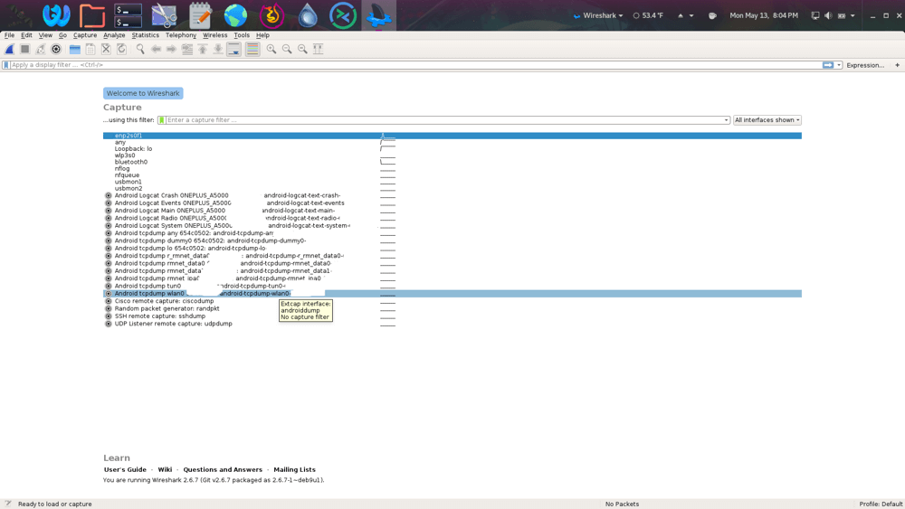

# Wireshark an Android Device
Running a tcpdump with Wireshark and Android is dead simple and requires no apps, aside from Wireshark and ADB / Android Debug Bridge.

This assumes the following:
- ADB is installed
- Wireshark is installed

Setup:
1. Connect the Android device via USB
2. Run `adb devices` in your PC's terminal
3. Open Wireshark

You should see a bunch of Android interfaces once you're latched onto ADB:


I highlighted **wlan0**, because I had my phone's wifi turned on, so this was the interface I wanted to sniff traffic for.

Double-click the selection, or click the shark fin at the top of the window to start listening for traffic.

Easy.

When you're done, kill the ADB server:
```bash
adb kill-server
```

And unmount the device from the PC.
