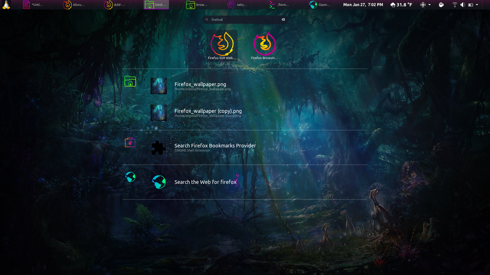

# Separate Browsing Profiles on Linux and Firefox ESR
It's rather easy to set up totally separate browser profiles to segment bookmarks, preferences and saved sessions; as if you have completely separate browsers.

They use the same "executable," but can be run at the *same* time.  Useful for shared computers or if you want a VPN profile, shopping or a browsing profile, independent of each other's clutter.

These steps would be similar for a Windows install, the paths would simply differ.

In my example, I created a **browsing** profile.

## First, create the new profile
Go to `about:profiles` and create a new profile > a wizard will launch

### Bring Over Bookmarks
If you want to copy bookmarks from another Firefox install, the path is as follows:
- Firefox: `/home/yourusername/.mozilla/firefox/[profile id].default/bookmarkbackups`

Simply drag **bookmarkbackups** into your new profile, at: `/home/yourusername/.mozilla/firefox/[profile id].browsing/bookmarkbackups` (note the **.browsing** in the profile path -- that's my new profile)

### Copy Extensions from One Profile to Another

Only copy the extensions from the same browser instance/directory.

Copy the following folders and their content from your **.default** profile:
```text
/home/yourusername/.mozilla/firefox/[profile id].default/extension-data
/home/yourusername/.mozilla/firefox/[profile id].default/extensions
```

to:
```text
/home/yourusername/.mozilla/firefox/[profile id].browsing/extension-data
/home/yourusername/.mozilla/firefox/[profile id].browsing/extensions
```

On first load, it will take a moment for them to appear in the Add-Ons dashboard.

That's it.

### Create a Desktop Shortcut and Launcher
Head to `~/.local/share/applications` and create **firefox-esr-browsing.desktop**

Append the following:
```bash
[Desktop Entry]
Version=1.0
Type=Application
Name=Firefox Browsing Profile
GenericName=Web Browser
Comment=Browse the World Wide Web
Icon=firefox-trunk
Exec=/usr/lib/firefox-esr/firefox-esr %u -P browsing
NoDisplay=false
Categories=Network;WebBrowser;
MimeType=text/html;text/xml;application/xhtml+xml;application/xml;application/vnd.mozilla.xul+xml;application/rss+xml;application/rdf+xml;image/gif;image/jpeg;image/png;x-schem$
StartupWMClass=Firefox-esr
StartupNotify=true
Terminal=false
```
The important part is the **Exec** line, which specifies the `-P` (profile) flag with my profile name that I want to launch when this shortcut is clicked.

You can optionally use the "Menu Editor" application, too, to create this launcher and change the icon.

### Add to Your Favorties
1. Search for Firefox in your desktop applications


Note that I have *two* entries for Firefox, one is the Browsing shortcut I just created as **firefox-esr-browsing.desktop**

2. Right-click on the new Firefox shortcut you created > Add to Favorites


