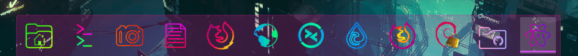

# Dock Shortcuts on Linux Desktop Environments
Custom dock shortcuts for targets that aren't applications.  These instructions are for desktop environments using Gnome Shell v3.22.3+



Aside from normal applications in my dock launcher, I like to link specific Firefox profiles, as well as a file manager/nautilus shortcut to my Git folder.

## Custom Nautilus Folder Launcher
Open a particular folder in Nautilus file manager.
1. Add **git.desktop** (as seen in this repo directory) to `~/.local/share/applications/`
2. Then, go to Applications (location varies depending on your setup) > search for **git**
3. Right click > Add to favorites

Now when you click the Git folder icon in the dock, it automatically goes to the Git directories: **/storage/git**

In **git.desktop**, modify the following to suit your environment:
```bash
Exec=/usr/bin/nautilus --new-window /storage/git
```
As well as Title, Name, Icon etc.


## Custom Firefox Shortcut Launcher
This achieves the same as launching a new profile from `about:profiles` - but is much quicker.

1. [Create your new profile](https://github.com/angela-d/brain-dump/blob/master/browsers/setup-browsing-profiles.md) in `about:profiles` if you haven't already
2. Add **firefox-esr-browswing.desktop** (as seen in this repo directory) to `~/.local/share/applications/`
2. Then, go to Applications (location varies depending on your setup) > search for **browsing**
3. Right click > Add to favorites

In **firefox-esr-browsing.desktop**, modify the following to suit your environment:
```bash
Exec=/usr/lib/firefox-esr/firefox-esr %u -P browsing
```

As well as Title, Name, Icon etc.
