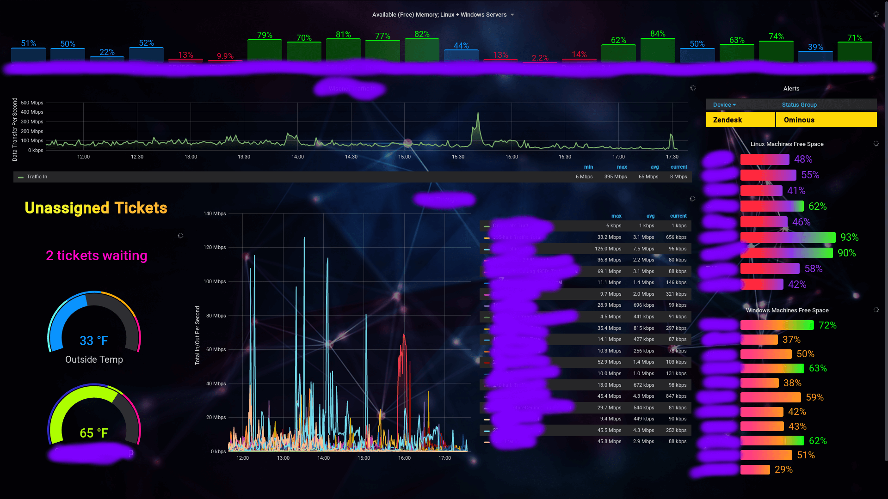
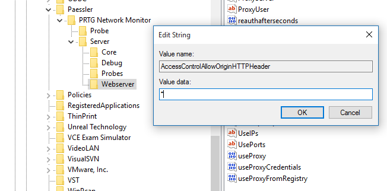
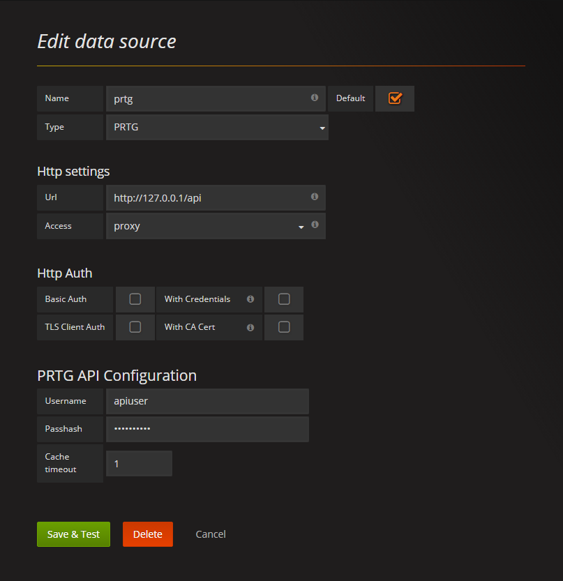
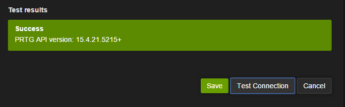

# Grafana and PRTG
My notes + bits from the Grafana documentation and [neuralfraud's wiki](https://github.com/neuralfraud/grafana-prtg/wiki) (which is sorely lacking in thorough documentation).

My setup:

Application | Version
------------|----------
**Grafana** | Grafana v6.5.3 (05025c5)
**PRTG Plugin** |  v4.0.3 (development branch from Github)
**PRTG** | 19.4.54.1506+

## Install Grafana
Apparently Grafana also runs on Linux, but since this is primarily for PRTG, it made the most sense to install it to PRTG's Windows Server.

***

- [Install instructions from Grafana](https://grafana.com/docs/grafana/latest/installation/)
- **To upgrade:** (Windows) Download a newer package from the install link above and extract to the same location (and overwrite the existing files). **This might overwrite your config changes.** Save a copy of the config to the desktop, prior to upgrading - from `C:\Program Files\GrafanaLabs\grafana\conf\custom.ini` as this will make upgrades easier without risking losing your config changes.

## Set up the PRTG Plugin on Grafana
**Preliminary Setup**

*The following only needs to be done once, the first time Grafana is installed.*

### Create a User in PRTG for API Access
Set up an **administrator** user in PRTG.
Setup > System Administration > User Accounts > **+** to add a new user

Use the following options:

Option | Value
-------|-------
**Account Type** | Read/write user
**Acknowledge Alarms** | User may not acknowledge alarms (default)
**Primary Group** | PRTG Administrators
**Date Format** | MM/DD/YYYY HH:MM:SS (AM/PM)

Save the user.

Now, obtain the Passhash by clicking the **Passhash** button, after the page refreshes.

- If you try to enable the API in Grafana by using the password, authentication will fail.
- If the user is in the PRTG User Group/read-only, you will not get full API access.
- When the user’s password is changed, the passhash will change, also.

You will need to configure PRTG to add an `Access-Control-Allow-Origin` HTTP header. This can be done in two simple steps:

1. Add a String value named `AccessControlAllowOriginHTTPHeader` to the registry key: `HKLM\Software\Wow6432Node\Paessler\PRTG Network Monitor\Server\Webserver`

2. Go to `services.msc` and restart the `PRTG Core Server` service

**Plugin Setup**

Due to prior reported bugs, I selected the Development branch.

1. Obtain the plugin from https://github.com/neuralfraud/grafana-prtg
2. On the small branch button (that says Branch: **master**), click it and select **Development**
3. Click the green **Clone or Download** Button
4. Select **Download ZIP** and save
5. Unzip the downloaded file > Navigate to the `jasonlashua-prtg-datasource` directory; drag `jasonlashua-prtg-datasource` into the Grafana directory (on the Grafana server): **data/plugins** - on a Windows machine, this is `C:\Program Files\GrafanaLabs\grafana\data\plugins`
6. Go to `services.msc` and restart the **Grafana** service
7. Select the **Datasource** page and click the "**Add new**" button
8. Under Edit Data Source, Choose a simple name, e.g., "PRTG" and select "prtg" as the data source type.
9. Under HTTP Settings, provide the API URL (http://prtg.example.com/api)
10. Typically you should chose "**Server**" as the **access** mode unless you specifically want the web browser to directly communicate with PRTG
11. Skip the **Http Auth** section
12. Under **PRTG API Configuration**, provide the username for the account you will be accessing the API as. For the passhash, you will find this in the PRTG account page for that user. **Providing the password will not work.** 
13. Click the "Test Connection" button to verify your datasource connection 

***

## Building a Dashboard
Once you have an object set up how you like it, click the Save button in the upper-right corner of the page, or your work may get lost!

The same rule applies when sliding objects across the Dashboard - after a sensor object is created, it will appear instantly on your dashboard.  Once there, you can move it around by hovering and clicking its heading.

**On the left menu:**

*(Basic sensor objects)*

1. **+** > Create > Dashboard (or, if one already exists you want to add to, click the chart-looking button on the top-right)
2. Add Query > Query will have a few options, leave it at PRTG
3. Most board objects will utilize Metrics > Click Groups and you should see your Groups from PRTG load > select one (note that sometimes this section seems to lag, so if something isn’t loading right away, wait or save and come back to it) - try to trial a few singular channels, first; the tables and groups are trickier to get flowing until you become familiar with the plugin
4. Once your Group is active, click onto the Hosts box and you should see a further drilled-down menu of your group objects appear - if you’re building a graph where you want all of the objects to be grouped, select the star ( * )
5. Onto the Sensor field > same deal here
6. Channel will follow suit with the other options
7. As you're clicking around, you should start seeing your values filled in.

**Note that the values seem to default to priority, so you’ll want to pay attention to the values until you're sure the API is returning things correctly.**

**Nothing is returning, at all:**

Run a query test by selecting **Query Inspector** in the Add/Edit Panel > Query window

*(Grouped objects, like alert tables)*

1. **+** > Create > Dashboard (or, if one already exists you want to add to, click the chart-looking button on the top-right)
2. Add Query > Query will have a few options, leave it at PRTG
3. Query mode: Raw > URI: `table.json` > Query String: `content=sensors&columns=device,sensor,status,message,downtimesince&filter_status=4&filter_status=5`
4. Click to Visualizations (right-side graphical menu) > Table Transform: JSON Data > Columns: *[here you click + and specify what data you want to show; it should auto-detect on-click, what’s available for use]*
5. You should start seeing stuff appear in your sample window as you go.

**Rename Columns on Alert Tables**

While still on the **Visualizations** screen:
1. Add/modify any column you want to change
2. To rename the **device** field, under **Apply to columns named:** `device` > **Column Header:** `Device` - you should see the column header as capitalized after clicking the tab button.  Repeat for any other headers you want to change.

**Change Row Colors Based on Status (Tables)**

Option | Value
------------ | -------------
**Apply to columns named** |status_raw
**Thresholds** |`4,5` (warning,error)
**Color Mode** | Row

Experiment with the color pallete inside this table.

**Regex Queries**
- [Group Sensor](regex-query.md) - Query similarly-named (but different) sensors that are members of the same Group

**Custom background / images and CSS**
- [Custom styles](custom-background-styles.md) - Add gradients, heading styles and custom icons to your dashboard

**Preview Your Dashboard**

While on the dashboard view, click the monitor icon; click once more to enter kiosk mode and remove the headers.  ESC to quit kiosk mode.

**Share the Dashboard**

Click the arrow in the upper-right corner
If you want the shared dashboard to refresh, append `&refresh=3m` to the address bar of your browser.  By default, a username & password are required for previews.  Apparently you can make "groups" that don’t require such - I've not yet set up.

**If Values Don’t Quite Match Up**

Check the timing in the top right. Set the quick range to Last 5 Minutes. Make sure that the Value Stat is set to Current, as it defaults to Average

**Useful Links**

- [PRTG KB Thread about Grafana](https://kb.paessler.com/en/topic/77458-are-there-alternatives-to-maps) - Some of my notes were obtained from here
