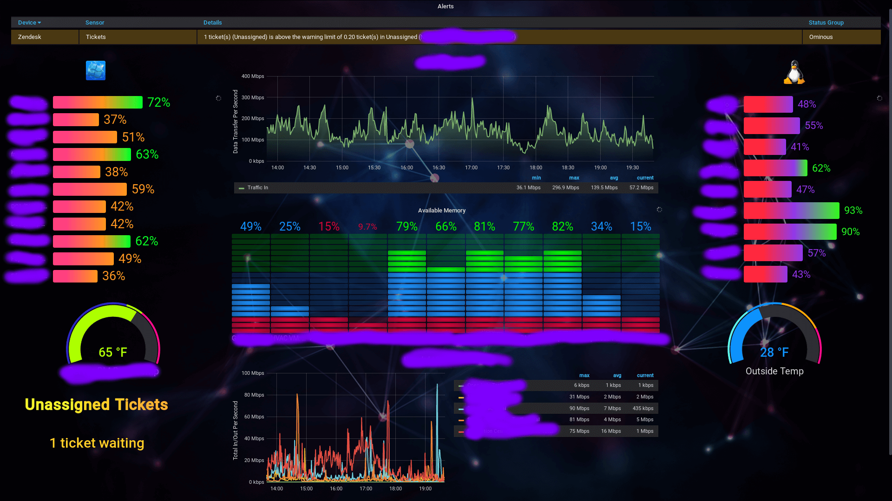

# Grafana and PRTG
My notes + bits from the Grafana documentation and [neuralfraud's wiki](https://github.com/neuralfraud/grafana-prtg/wiki) (which is sorely lacking in thorough documentation).

My setup:

Application | Version
------------|----------
**Grafana** | Grafana v6.6.0 (5c11bbdfb4)
**PRTG Plugin** |  v4.0.3 (development branch from Github; master branch seems to break historic data charts)
**PRTG** | 19.4.54.1506+

Grafana also runs on Linux (which is easier to maintain + substantially lighter on resources), but since this is primarily for PRTG, it made the most sense (for me) to install it to PRTG's Windows Server.

Some of my notes will reference the Windows-install, as a result.  If you use Grafana for mostly things other than PRTG, the Linux version is probably the best way to go!

***

**Initial Setup**
- [Create an API-only user & group](setup.md) - Setup instructions for both Grafana and the PRTG Grafana plugin

***

**Build a Dashboard**
- [First Step](build-a-dashboard.md) - Single results or grouped graphs

**Statistical**
- [Group Sensor](regex-query.md) - Query similarly-named (but different) sensors that are members of the same Group
- [Data Transfer Rates](data-transfer-rates.md) - Getting the correct unit measurements
- [Combining Queries](grouping-results.md) - Combining two separate sensor results in the same map

**Visual**
- [Custom styles](custom-background-styles.md) - Add gradients, heading styles and custom icons to your dashboard
- [Adjust Bar Gauge Legend](remove-bar-gauge-label.md) - Remove the repeated channel on the bar gauge legend
- [Sort Ordering](sorting.md) - Sort options in graphs

**Troubleshooting**
- [Common Problems](troubleshooting.md) - Weird bugs and quirks and how to bypass them

**Preview Your Dashboard**

While on the dashboard view, click the monitor icon; click once more to enter kiosk mode and remove the headers.  ESC to quit kiosk mode.

**Share the Dashboard**

Click the arrow in the upper-right corner
If you want the shared dashboard to refresh, append `&refresh=3m` to the address bar of your browser.  By default, a username & password are required for previews.  Apparently you can make "groups" that don’t require such - I've not yet set up.

**Backup a Dashboard**

Dashboards are kept in a .db file, I haven't experimented much (yet) with some of the backup tools others have built.  For a quick backup, click the *Share* button on a dashboard (arrow icon, top-right of the dashboard) > click the **Export** tab > Save to File

**Add https to Grafana**
- [Encrypt your connection](enabling-ssl.md) - Enable SSL on your Grafana server

**Useful Links**

- [PRTG KB Thread about Grafana](https://kb.paessler.com/en/topic/77458-are-there-alternatives-to-maps) - Some of my notes were obtained from here
