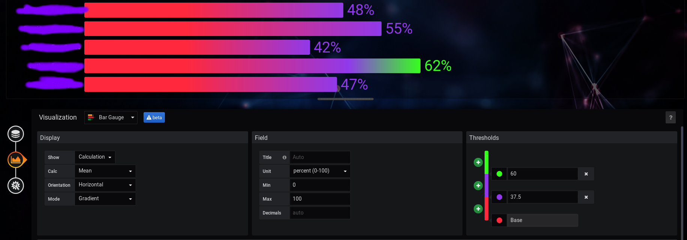

# Adding a Custom Background to Grafana
As of Grafana v6.5.3 (05025c5), custom CSS and backgrounds are not natively supported.

Custom backgrounds and CSS can be achieved via the plugin [Boomtheme Panel](https://github.com/yesoreyeram/yesoreyeram-boomtheme-panel)

Although the developer's instructions state the panel options will appear under dashboards, for me they did not.

*After* I created a panel and went into the **Vistualization** section, I was able to select Boom Theme as a panel.

## Gradient CSS


The **Unassigned Tickets** heading gradient and custom background was achieved with Boomtheme Panel.

### Custom Background
1. Create a new panel and go straight into **Choose Vistualization**

2. Select Boom Theme

3. I don't like to hotlink images, so I loaded my custom images on my Grafana server (which will likely be wiped in future upgrades, fyi; if you do this, make sure you back it up prior to upgrading!) -- Go into your images directory; on a Windows install, it's `C:\Program Files\GrafanaLabs\grafana\public\img` and *create a new directory* in there, called **custom**
4. Download the image you want to use as your background and place it in the **custom** directory
5. Back in the Boom Theme panel you created moments ago, delete the default hotlinked image and replace it with the *public URL* to your Grafana install.  ie. `http://grafana.example.com:3000/public/img/custom/background.png`

You should now have a styled background.

### Gradient Text
1. Create a new panel, but select **Text** as the **Vistualization**
2. Either do your own styled gradient here or use a [generator](http://patorjk.com/text-color-fader)
3. Paste your code/text and select the **Mode** as `html`

That's it.

### Gradient Bar Graphs
This is a native function of Grafana:


As are the neon colors:

### Neon Colors
On the color pallete, click on the red circle to change the red color (for example) > Custom > move the dial until you find the color you like.  Repeat for other color options.

### Linux and Windows Dashboard Icons
These too, are via native capability. Create a new **Text Panel**, similarly to the Gradient Text setup.

Create a new html/markdown panel and simply call your image with **Mode** `markdown`:
```html

```
