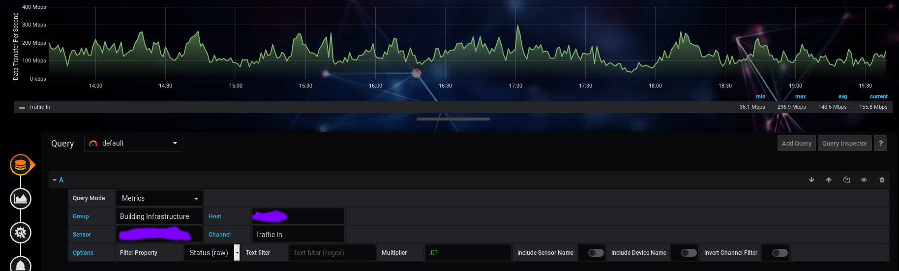
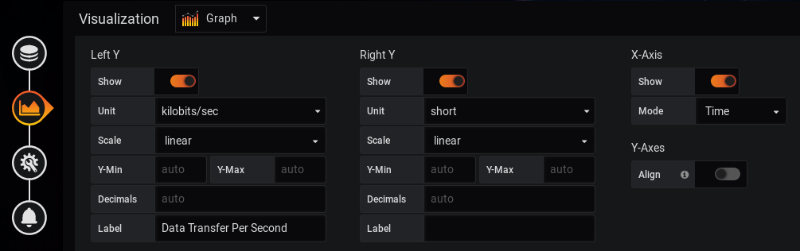

# Data Transfer Rates
Pulling the data transfer rates from an SNMP sensor was mildly tricky, as its currently only documented in the plugin's Github issues tracker.

- The measurement rates are in [kilobits](https://kb.paessler.com/en/topic/75876-bandwidth-unit-and-measurement)
- The **Multiplier** option in the PRTG plugin had to be set to `0.1` to display a correct reading

Screenshot of the **Query** values:

Screenshot of the **Visualization** measurement values:

