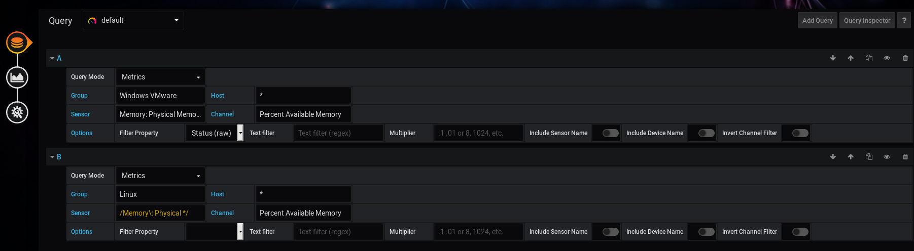

# Grouping  Results
For sensors you want to group, but are from unfamiliar channels.

From the create/edit dashboard window > Query (as seen above)

1. In query Window A, set the initial channel you want to pull

2. Toward the top of that same section, click **Add Query** to add another similar, but unrelated sensor.

In my example, I group both Windows VMs and Linux machines available memory, as they both have the same destination channel, "Percent Available Memory"

## Rename or Regex Sensors
Some sensors have different names, but return the same values.  For example, some Linux devices have:
- Memory: Physical Memory
- Memory: Physical memory

To ensure I don't miss any, I regex the query, by wild-carding the **sensor**: `/Memory\: Physical */` -- that way, even if the underlying query is case-sensitive, all of my desired sensors will get pulled in.

## Dissimilar Sensor Names
If the sensors are named entirely different, *you can rename them*.  The Grafana plugin should pick up any changes on the next refresh.
