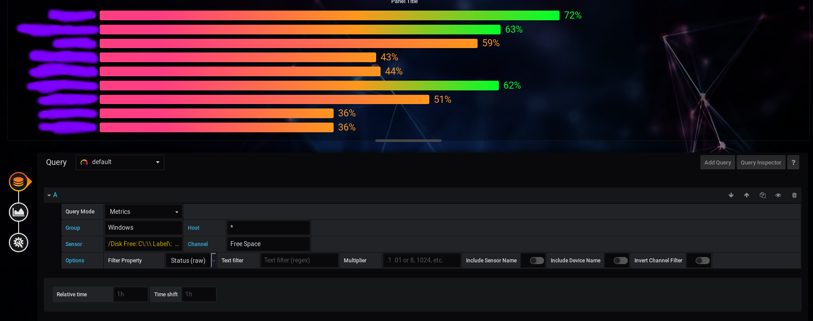

# Regex Query
If you want to chart out something like disk space for Windows machines, the PRTG Grafana plugin pulls the *disk serial*, as separate sensors **each**.

To query *all* of your Windows disk space sensors (from a **Group**) at once, you can set the following (head to the Query window):

Field | Value to Use
----------|----------
Query Mode | `Metrics`
Group | `Windows` *(for example)*
Host | `*`
Sensor | `/Disk Free: C\:\\ Label\:  Serial Number */`
Channel | `Free Space`

Note that special characters have to be escaped, else the regex won't parse correctly.

Result:

