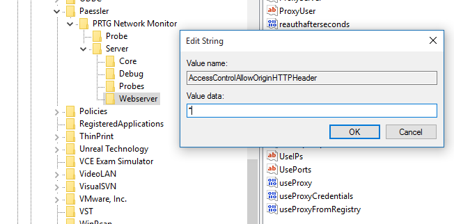
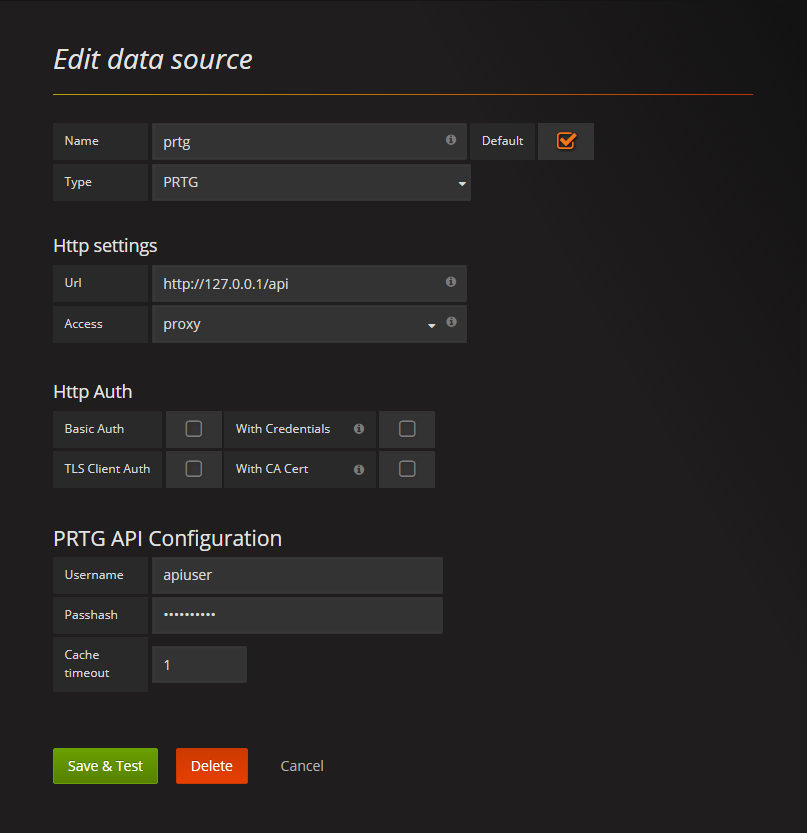
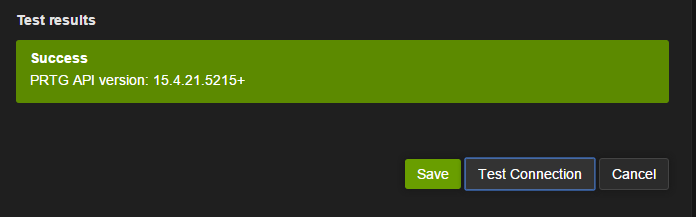

# Preliminary Setup
*The following only needs to be done once, the first time Grafana is installed.*

- [Install instructions from Grafana](https://grafana.com/docs/grafana/latest/installation/)
- **To upgrade:** (Windows) First, **backup**.  Then, download a newer package from the install link above and extract to the same location (and overwrite the existing files). **This might overwrite your config changes.** Save a copy of the config to the desktop, prior to upgrading - from `C:\Program Files\GrafanaLabs\grafana\conf\custom.ini` as this will make upgrades easier without risking losing your config changes.  Shut down the Grafana service, else you'll be prompt for a system reboot to complete the upgrade.  *If custom.ini gets wiped during the upgrade, it is also wise to diff the new custom.ini with your backup, incase new options were added.*

### Create a User in PRTG for API Access
1. Create an API user group, with restricted permissions.  Setup > System Administration > User Groups > **+** > Add User Group

Use the following options:

Option | Value
-------|-------
**User Group Name** | API
**Use Active Directory** | No
**Allowed Sensors** | Users may create certain sensor types only
**Members** | *(add grafana here, later)*

2. Setup the Grafana user.  Setup > System Administration > User Accounts > **+** to add a new user

Use the following options:

Option | Value
-------|-------
**Account Type** | Read-only user
**Acknowledge Alarms** | User may not acknowledge alarms (default)
**Primary Group** | API
**Date Format** | MM/DD/YYYY HH:MM:SS (AM/PM)

Save the user.

Now, obtain the Passhash by clicking the **Passhash** button, after the page refreshes.

3. Go back to the **API** group and add **grafana** to it.

4. Go to your **Root** group, probably at `https://prtg.example.com/group.htm?id=0&tabid=8` (change URL to suit your setup) >  > scroll to "Access Rights" > adjust API > Read access > Save

Worth noting:
- *If you try to enable the API in Grafana by using the password, authentication will fail.*
- *When the user’s password is changed, the passhash will change, also.*

***

You will need to configure PRTG to add an `Access-Control-Allow-Origin` HTTP header. This can be done in two simple steps:

1. Add a String value named `AccessControlAllowOriginHTTPHeader` to the registry key: `HKLM\Software\Wow6432Node\Paessler\PRTG Network Monitor\Server\Webserver`

2. Go to `services.msc` and restart the `PRTG Core Server` service

**Plugin Setup**

1. Obtain the plugin from https://github.com/neuralfraud/grafana-prtg
2. Click the green **Clone or Download** Button
3. Select **Download ZIP** and save
4. Unzip the downloaded file > Navigate to the `jasonlashua-prtg-datasource` directory; drag `jasonlashua-prtg-datasource` into the Grafana directory (on the Grafana server): **data/plugins** - on a Windows machine, this is `C:\Program Files\GrafanaLabs\grafana\data\plugins`
5. Go to `services.msc` and restart the **Grafana** service
6. Open the Grafana web UI at http://localhost:3000/ if you're connected to the server where Grafana is installed, or http://<grafana's-server-IP-address>:3000 otherwise. Log in with user admin and password admin. Grafana will ask you to change the default password upon the first login.
7. Select the **Datasource** page and click the "**Add new**" button
8. Under Edit Data Source, Choose a simple name, e.g., "PRTG" and select "prtg" as the data source type.
9. Under HTTP Settings, provide the API URL (http://prtg.example.com/api)
10. Typically you should chose "**Server**" as the **access** mode unless you specifically want the web browser to directly communicate with PRTG
11. Skip the **Http Auth** section
12. Under **PRTG API Configuration**, provide the username for the account you will be accessing the API as. For the passhash, you will find this in the PRTG account page for that user. **Providing the password will not work.** 
13. Click the "Test Connection" button to verify your datasource connection #
