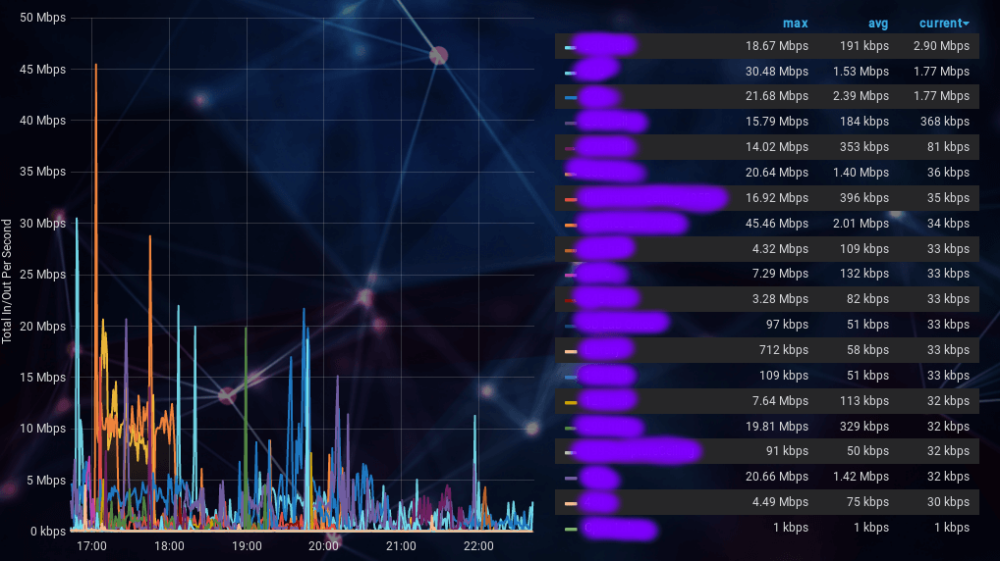

# Sorting on Grafana
It's not immediately obvious how to "sticky" a setting if you use Grafana for TV Displays and not as something you routinely click on a PC monitor..

## Graph Visualization

1. In the screenshot, the table headings (max, avg, current) determine the sort order.  Simply click the order you want > Save
2. For good measure, after the graph layout is saved, I save the dashboard view, too.
