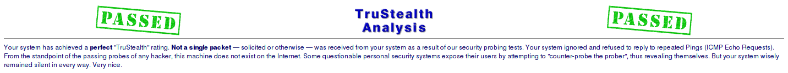

# Additional Security / Post-Installation Hardening

Default router setups are not secure.  Utilizing [GRC's Shields Up!](https://www.grc.com/default.htm) > All Service Ports scans can help locate things overlooked while configuring the network.

**After [setting up VLANs](README.md) for untrusted devices**
- Most ports were closed
- On OpenWRT, DNS/port 53 was wide open

To remedy this:
```bash
vi /etc/dnsmasq.conf
```

Add the following (All gateway IPs of each VLAN used):
```bash
listen-address=192.168.1.1, 192.168.3.1, 192.168.2.1, 127.0.0.1
bind-interfaces
```

Restart the daemon:
```bash
/etc/init.d/dnsmasq restart
```

- Test any affected networks/VLANs
- Re-run the scan


***

## Security by obscurity

Move SSH off of port 22.  Even if you firewalled it by IP, its a nice habit to get into.

In OpenWRT web gui:

Systen > Administration
- Change **Port** from 22 to some non-standard port
- Un-tick Allow root logins with password (*only* if you supply an SSH key!!)
- Un-tick Password authentication (again, **only** with the presence of an SSH key)
- Add your pubkey in the textarea beneath the SSH Keys header
- If you already have firewall rules locking down port 22 by an IP filter, adjust that rule to reflect the new port

### Add an alias because you probably won't remember the port you changed it to
```bash
pico ~/.ssh/config
```

Append the following:
```bash
Host router
HostName 192.168.1.1
Port 2299
User root
Compression yes
IdentityFile ~/.ssh/path/to/your/privatekey
```

Now anytime you need to SSH into the router, simply run:
```bash
ssh router
```
- Make backups of the router config *and* `~/.ssh/config`

It should be noted that if you do *not* firewall by IP range (only allow *your* local, trusted IP range), the port can still be discovered if its wide open by any self-respecting script-kiddie.

If you do not intend to use SSH, turn it off altogether.

***
### Stealth Ports
With just the above setup, classic hot ports are sealed, but still advertising their existence to probers.

Network > Firewall
- wan: change **input** values to drop, accept, drop

Network > Firewall > Traffic Routes tab (same page)
- Under *Allow-Ping: source address any*
- Change *source address* to 192.168.0.0/22

This gives the trusted VLAN the ability to send ICMP/pings to other VLANs (and devices allowed to probe eachother, within their respective network) which is useful for debugging and testing devices.

**Warning:** If your ISP needs to troubleshoot latency, you may want to change back to 'any' until they're done.

- *Allow-ICMPv6* entries: I deleted these, I don't maintain ip6 at home.  Leaving them running is just another vector for probes.

- `/etc/init.d/firewall restart` and run a new test at GRC.



***
### Torrenting with OpenWRT
This setup blocks torrenting.  To open torrenting capabilities, some 'holes' need to be punched.

To whitelist torrenting on all VLANs, first go into the torrent client preferences and un-tick incoming/outgoing random ports.  Pick port(s) and assign them there.

It's probably a good idea to use non-standard port(s), as a lot of ISPs block the defaults (6881-6889).

 Then, in OpenWRT:

Network > Firewall > Custom Rules tab
- Append the following:
```bash
# allow torrenting to all vlans
iptables -A INPUT -m conntrack --ctstate RELATED,ESTABLISHED -p udp --dport 50412 -j ACCEPT
iptables -A OUTPUT -p udp --sport 50412 -j ACCEPT
```
- Replace 50412 for the port(s) chose and duplicate the rule syntax for each port to allow.

- `/etc/init.d/firewall restart` and switch on a VPN, download some torrents.
