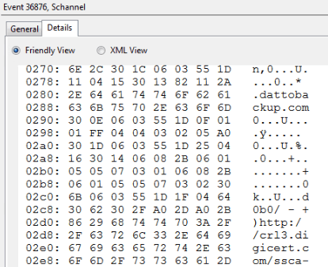

# Unable to Backup Machines
Problems I ran into during initial Datto deployment.

## Windows
For systems that aren't quite air-gapped, but close enough to it (allowing only 1 or 2 services network activity) you'll run into Schannel errors when first deploying the Datto agent to a Windows machine -- you'll have to allow more network activity.

Pre-setup:

- Have the proper [firewall rules](datto-firewall-rules.md) in place to lock down the ports Datto listens on, so only Datto can communicate on them
- Initial deployment requires access to `*.dattobackup.com` - add the wildcard entry in your firewall appliance to open it up for the target host (I didn't do any of this on the client firewall, as the machine is on an isolated VLAN, governed by a firewall appliance that sits between client machines and the internet)

Post-setup:

- While attempting to pair an agent-based setup, the following error appears in **Event Viewer > Custom Views > Administrative Events** and the Datto service continuously crashes when attempting to pair:
  > The certificate received from the remote server has not validated correctly.  The error code is 0x80092013.  The SSL connection request has failed.  The attached data contains the server certificate.

    - Click on the Details tab
    - Scroll a bit, until you see some semblance of a FQDN:
    
      - `*.dattobackup.com` is using the CA `cr13.digicert.com`, so allowing this FQDN as an outgoing connection should allow the backup to commence.
      - I allowed the following, for outgoing traffic (if you have an AV client like Sophos, the following should work for it, too):
      ```bash
      crl.globalsign.com
      crl.globalsign.net
      crl3.digicert.com
      crl4.digicert.com
      ocsp.digicert.com
      ocsp.globalsign.com
      ocsp2.globalsign.com
      ```

## Linux
It's now the end of 2023, Debian 10 is EOL and Datto (Kaseya) still does not support Debian 11.  It has a memory leak and inevitably consumes 100% CPU.

Their official recommendation is a "regular reboot to free the memory" and "we're working on a fix, but there's no eta"

Regular reboots (at least with VMware VMs) boot up with a blinking cursor ( - ) and require a hard reset to come back up.

 - [also worth a read](https://old.reddit.com/r/msp/comments/10k7a6x/datto_may_support_linux_but_chances_are_youll_end/)

### Debian 9 to 10 notes
Datto's [Linux support table](https://help.datto.com/s/article/KB360040893811) doesn't list Debian 9, despite supporting every other version back to Debian 6.

Attempting to use Datto with Debian 9 will find the `/tmp` directory become read-only, until a reboot or re-mount.  The issue will resurface with each subsequent attempt.

Fix:
- Upgrade to Debian 10

Cause:
- Unknown.  Datto support didn't have the technical details as to why this version is unsupported.
