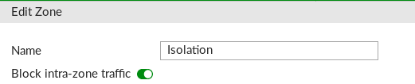

# Disable Internet Access for EOL Systems with a Fortigate Firewall
Isolate a system that shouldn't have internet access, but route along a local subnet.

Useful for EOL operating systems (Windows) that can't be upgraded due to software version restraints; but don't require internet access, anyway.

### GUI Setup

## Deny access to the web and other VLANs
1. Create a new VLAN via Network > Interfaces
2. Add that new VLAN to an Isolation zone (if you don't have one already, build one that has intra-zone traffic blocked)

3. Policy & Objects > IPv4 Policy > Create New
  * Name: Block EOL from Web
  * Incoming Interface: Isolation
  * Outgoing Interface: any
  * Source: Add the network's address as set for the VLAN; ie. `172.27.0.0/24`
  * Destination: all
  * Service: ALL
  * Action: **DENY**

Run some ping tests and you'll see the device has no outside access any longer, but access to the VLAN gateway, or other devices on the same subnet should still be ping-able.

## Whitelist Access
For the servers that need to communicate with an isolated device.

This example will be the isolated device communicating with a controller on a VLAN in the **Trust** zone.

1. Policy & Objects > IPv4 Policy > Create New
  * Name: Access to EOL Device
  * Incoming Interface: Isolation
  * Outgoing Interface: [Zone where the source device is kept; ie. "Trusted"]
  * Source: [IP address of the isolated device]
  * Destination: [IP address of the trusted device controller]
  * Service: [Service(s) the isolated device needs to talk to]
  * Action: **ACCEPT**

**Place this rule above the DENY rule, created previously.**

That's it!

---
Worth noting:

The isolated machine's network adapter will have the "Unidentified network" warning across it.  As long as the machine is still accessible, this doesn't seem to matter.
