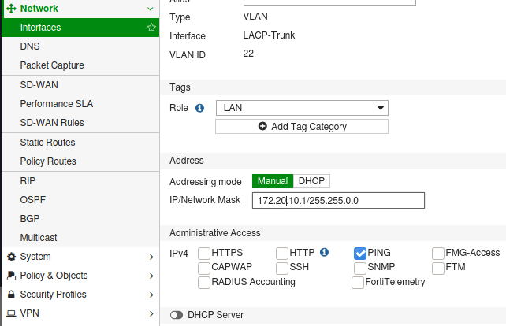
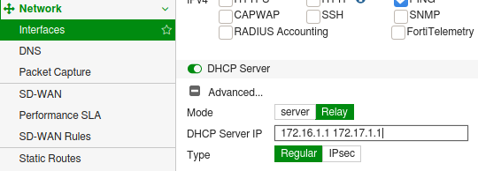

# DHCP Relay to an Active Directory Domain Controller On a Fortigate
Use your Fortigate as the gateway, but delegate DHCP to an Active Directory DC.

I prefer to work in the firewall GUI, so these notes are based on that.  These options are hidden by default!

## Create a New DHCP Scope on the Domain Controller
Assuming you already have the DHCP role installed on your DC:
1. Open the **DHCP** app > IPv4 > right-click > New Scope
2. Choose your IP address range and subnet mask
3. Follow through the wizard and when prompt to configure DNS, choose yes
4. Set your DNS server and domain (should auto-populate); when prompt, activate

### Add the subnet to Active Directory Sites and Services (else you'll get log clutter)
1. Open **Active Directory Sites and Services**
2. Under Sites > Subnets > right-click > New subnet.. > add the .0 of the host you added for DHCP and select the site it belongs to

## Configure the Fortigate to Relay to the DC
1. Set up the **Interface** and zone (if necessary)
  

2. Toggle **DHCP Server** (bottom of the above screenshot)
3. In the preceeding options that appear, click **+ Advanced**
4. Select **Relay** (the unnecessary options will disappear)
5. Specify your DHCP servers
  - Separate by a space
  - Up to 8 different IPs
    
