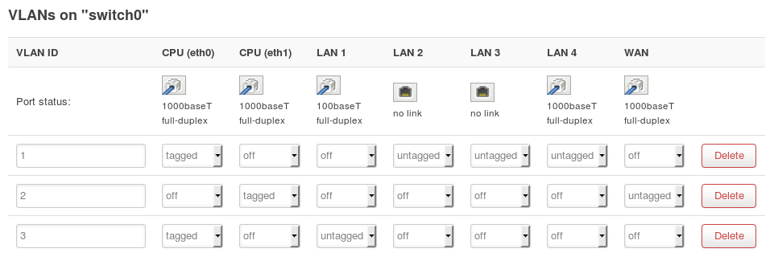

# VLAN Switchport Setup on OpenWRT

Traffic isolation for wired devices on routers running OpenWRT.

## Backup, first
System > Backup / Flash Firmware
- Generate archive
- Test the integrity of the backup by making a copy of it in another directory and extracting the content.  If you see the /etc directory, you're good to go.

Web GUI modifications:

### Setup the VLAN interface
**Network > Interfaces**
- Click 'Add New Interface' button
- Name the interface, something like 'vlan2'
- Protocol: Static IP Address (enter a network that differs from your main one.  ie. if your main is 192.168.1.x, use 192.168.2.1 here)
- Select 'Custom Interface' radio and enter a vacant eth ID, like **eth0.2**

Note: If your LAN is presently **eth1**, then you'd use *eth1.2*, instead.  If you have existing VLANs, increment the eth0.x to the highest unused number.

**Select DHCP server setup (same page)**

- Enter the starting octet (ex. 100)
- Enter the preferred total of IPs you'll be handing out; if you only have 1 device, set it low.  If multiple devices will connect, set higher.

Back up toward the top of the interface settings > 'Firewall Settings' tab

- Select the unspecified -or- create radio, fill 'vlan2'
- Save and Apply (bottom of the page)

### Switch configuration
The interface creation should have automatically generated a new VLAN ID for VLAN 2.  VLAN 1 is the "trusted" / default VLAN.

For me, the port ordering was backwards to the port numbers on back of the router; I unplugged the connections and set the one I wanted to isolate so I was sure to get the right port.  (OpenWRT will auto load/reload the active switchports with the baseT reading)

### Configure Forwarding and Isolation via Firewall Rules
**Network > Firewall from the main pulldown**

In this area we'll make it so the VLAN has web access.

LAN
- Edit > For *Allow forward to destination zones:*, tick 'vlan2' > Save & Apply at the bottom of page

wan
- Edit > For *Allow forward from source zones:*, tick 'vlan2' > Save & Apply at the bottom of page

vlan2
- Edit > Under *Covered networks*, tick *vlan2*
- For *Allow forward to destination zones:*, tick 'wan'
- For *Allow forward from source zones:*, tick *lan* > Save & Apply at the bottom of page

**Back on the Firewall main page**

Manually setting the firewall rules to segment the traffic; the GUI vlan setup does not automatically do this (as DD-WRT does if you tick 'Isolate')

**Under Custom Rules tab**

I set the rule numbers numerically to ensure they load sequentially.

Paste the [firewall rules](custom-firewall-rules.md)

Done!
