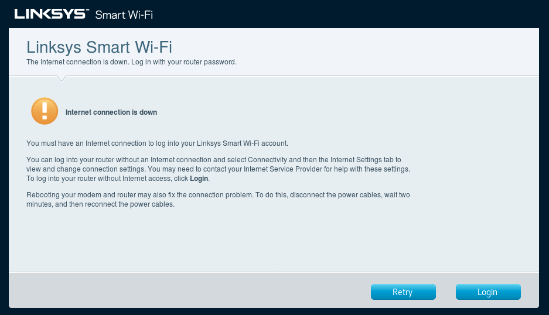

# Linksys WRT1900AC Router Flashed to Open WRT Firmware
Linksys' default GUI upgrade is a bit tricky if you don't do it all the time, as it demands an online presence.

If you purchased a used router, its a good idea to hold and press the red reset button on the back for 10 seconds.  Seems to be rather common that people don't wipe their stuff before they sell it!

The router lights will flash and power off for a second, when they return, proceed:

## Obtain the Open WRT Image
[Open WRT's site](https://openwrt.org/toh/linksys/linksys_wrt1900ac) has two different version for the WRT1900AC - check the bottom of your router.  If you don't see a v1 or v2, select the v1 image from the **Firmware OpenWrt Install** column.

1. Wire a direct connection from one of the numbered ethernet ports to a PC (not the 'Internet' port)

2. Turn the router on

3. If you have a manual-set IP, set it to 192.168.1.2; otherwise, DHCP is fine.

4. Load the Linksys GUI, at http://192.168.1.1 and select **Manual Configuration**

  

5. The router will complain there is no internet connection -- click **Login**:

  

6. Login with the password **admin**

  

7. In the left menu, select **Connectivity**

  

8. Beneath the *Router Firmware Update* menu, and the **Manual** box, select **Choose File** -- you're going to select the **.img** file you downloaded from OpenWRT's site.

  

9. Click **Start** to begin flashing

  

10. You'll get a warning, click **Yes**

  

11. Another prompt, basically saying don't touch it until it boots back up.  You can check its progress by continually reloading http://192.168.1.1 - once you see OpenWRT, go set a password and start configuring.


If you've previously flashed other WRT1900AC models, you can also copy over their settings by simply uploading their backup.  Any add-ons won't copy over, but firewall, interface, networking and switch config will. (Untested on v1 > v2 models, or vice-versa)

***
## Changing OpenWRT Builds
When jumping from vanilla OpenWRT to a custom build (or vice-versa) it is not necessary to downgrade to stock firmware.

However, you **do not** want to save settings; start fresh!!

More detailed steps in the [OpenWRT documentation](https://openwrt.org/toh/linksys/linksys_wrt1900ac)

1. Wire in to the router via ethernet
2. Obtain the .img for the build you want to use (as if it's a new install, *not* the .bin upgrade option for the build)
3. If uploading the **.img** via luci fails due to missing metadata, a flash via the router's command line will do the trick:
```bash
cd /tmp && opkg update && opkg install wget && wget <Image-Link>.img
```
4. Flash the image:
```bash
cd /tmp && sysupgrade -F -n -v <image-name>.img
```

## Upgrading
Upgrading OpenWRT is not like Linux, do not set unattended/automatic upgrades; things are known to break when doing so.

Upgrading is as simple as going to your build's vendor (for example, [OpenWRT](https://openwrt.org/toh/linksys/linksys_wrt1900ac)) and obtaining the latest **Firmware OpenWrt Upgrade** (.bin file) and uploading the .bin under the System > Backup / Flash Firmware section.
- You can opt to save settings when doing an upgrade, if you're staying on the same vendor build.  There is a checkbox for it.  Your config files will be retained, but you will have to re-install any addons (previous settings will re-populate upon reinstall).

- The dashboard will not alert you when there is a new release or security patch.  Keep track of it, yourself.

This thread [regarding updating OpenWrt](https://forum.openwrt.org/t/opkg-upgrade-vs-flashing-sysupgrade/58906) on the OpenWrt forum has a detailed discussion of why you shouldn't use the package manager (or GUI) even if updates are showing.

The only time I update packages outside of a sysupgrade:
- CVEs for a **particular application/component**, then, only the affected package will get updated until the next sysupgrade.
