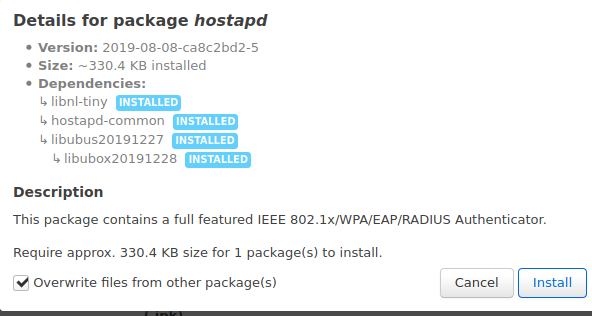
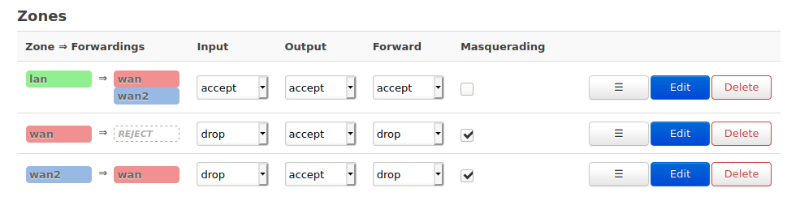

# Wifi VLAN for OpenWRT
Updated for OpenWrt 19.07.6

Useful to segment untrustworthy devices like "smart" TVs or wifi for guests and prevent bad behavior, snooping and surveillance of network traffic.

> Note that if you try to send data to the "smart" TV from another wifi network (like casting from a Youtube Android app, for example), you'll break that capability with device isolation.
>
> Your device may also need to login to this VLAN/SSID to communicate, unless you set up IGMP/inter-VLAN traffic for your desired device(s), which is outside of the scope of my notes.

## Backup, first
System > Backup / Flash Firmware
- Generate archive
- Test the integrity of the backup by making a copy of it in another directory and extracting the content.  If you see the /etc directory, you're good to go.

**Network > Interfaces**
- Click 'Add New Interface' button
- Name: `Guest`
- Protocol: `Static address`
- Click the radio for *Custom Interface* and fill `wan2` (hit enter to create) > Submit
- IPv4 address: `192.168.2.1`
- IPv4 netmask `255.255.255.0`
- Leave the rest blank and continue to the remaining tabs

**Select DHCP server setup tab (same section)**

- Enter the starting octet (ex. `100`)
- Enter the preferred total of IPs you'll be handing out; if you only have 1 device you want to put on this VLAN, like a tv, enter `1` for the limit.  If multiple devices will connect, set higher.
- Save & Apply

**Network > Wireless tab**
- Click 'Add'

### Under Device Configuration:
- Select the mode (`AC` for newer devices, `N` for legacy)
- Channel (ideally, channels with no neighboring access points are on)
- Channel width *(higher widths can both improve performace but may also cause disturbances; this option should be trialed to see what works best)*
- Transmit power *(shorter if your device is close, higher if farther away or needs to penetrate a lot of walls)*
- ESSID: `415bzp` (something uninteresting to bored people with scanners)
- Mode: `Access Point`
- Network: `wan2`
- WMM Mode (leave `ticked`; when disabled, can revert to legacy speeds in some routers)

## Under Interface Configuration:
**Wireless Security Tab**
- Encryption: `WPA2-PSK`
- Cipher: `Force CCMP (AES)`
- [x] Enable key reinstallation (KRACK) countermeasures
- Save & Apply

**802.11w Management Frame Protection** [[what is 802.11w?](https://www.cwnp.com/wireless-lan-security-and-ieee-802-11w/)]

Some users have reported disconnects when using this option.  Older devices (router/wireless devices) or cheap IOT devices may not support 802.11w, check your specific device for support, or trial and error.

**Check if your device supports 802.11w**
- Windows:
  ```powershell
  netsh wlan show driver
  ```
  > 802.11 Management Frame Protection supported : **Yes**

- Linux:
  ```bash
  sudo iw phy | grep 00-0f-ac:6
  ```
  > 		* CMAC (00-0f-ac:6)

  *If `00-0f-ac:6` is returned, 802.11w is supported.*


- Check to see what chip your router has (ath9k, ath10k, mwlwifi and mt76) are supported
- [Wikipedia](https://en.wikipedia.org/wiki/WRT1900AC) lists WRT1900AC as having Marvell (mwlwifi); so it is supported
- Check to see what version of wpad or hostapd you have: System > Software > Update Lists
- Under filter, search `wpad` and `hostapd`; I only had hostapd-common & wpad-basic, so I went ahead and installed `hostapd` to get the full version
  
  A /bin file also contained in *hostapd* already existed, so I ticked the checkbox to let it overwrite *(you'll get a warning if you attempt to install without checking the box; clearly read the warning & understand what will happen before opting to let it overwrite)*
- Head back into Network > Wireless > Wireless Security > select your preference of *Required* or *Optional* and set the values of the maximum & rety timeouts; if you're not sure what to use, use the defaults greyed in the boxes.
- Save > disconnect & reconnect your wifi devices to make sure none of them have troubles connecting

**Advanced Settings Tab**

Before ticking isolate clients, see the note at the top of this page.
- [x] Isolate Clients (devices can't talk to eachother)


### Configure isolation via Firewall rules
In this area we'll make it so the wifi VLAN has web access.

**Network > Firewall from the main pulldown** >
**Under Zones > Zone Forwardings:**
- lan:
  - Click Edit > For *Allow forward to destination zones:*, hit the pull-down, select `wan2` > Save & Apply at the bottom of page
- wan:
  - Click Edit > For *Allow forward from source zones:*, hit the pull-down, select `wan2` > Save & Apply at the bottom of page
- wan2:
  - Edit > Under *Covered networks*, tick `wan2`




**Back on the Firewall main page > Under Custom Rules tab**

**Note:** This page is a continuation of my [OpenWRT Switchport VLAN notes](openwrt-switchport-vlan.md), if you're utilizing both of these.. the firewall rules there might make more sense, as the version below was redone to fit wan2 into the mix.

Append the following:
- Paste the [firewall rules](custom-firewall-rules.md)

Done!
