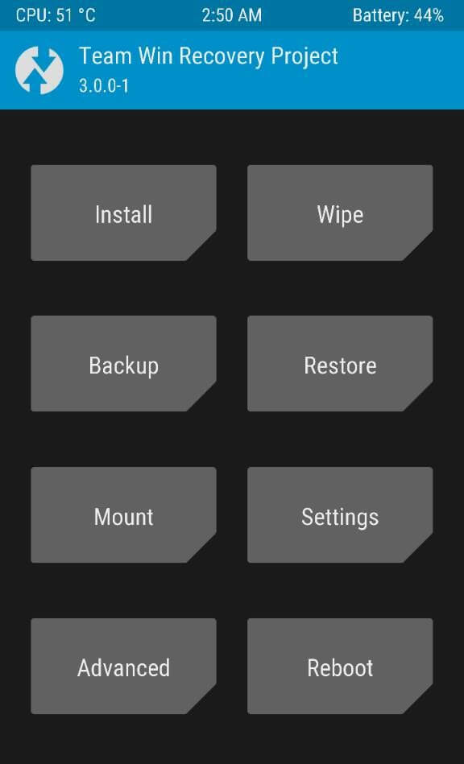
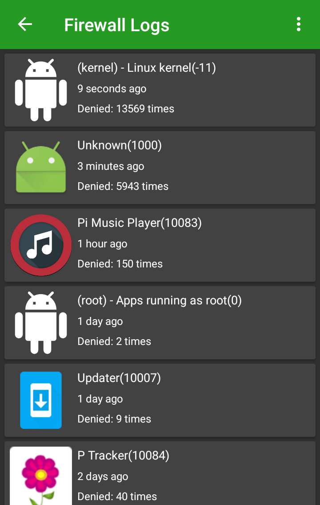

# De-googling Android with Lineage OS
Android is a lot cooler without Google's spyware hooked into everything.

There are many ways to de-google a phone, install Lineage (or even [LineageOS for microG](https://lineage.microg.org/)), this is how I've done it (steps taken from my personal note stash and updated/sanitized to be device agnostic).

Lineage for microG didn't exist when I first installed Lineage, but if I were to re-flash my phone, I'd probably use their version over Lineage, for less steps.


## Initial Setup
- Make sure your [phone](https://wiki.lineageos.org/devices/) can run Lineage OS. **Do not mix and match models.  If you use the wrong ROM, even if it's the same model/manufacturer, with a slight variation, you'll brick your phone.**
- Unlock your bootloader (check the manufacturer's site of your device for specific details on how to do it; some require software to be downloaded and used to unlock)
- Install [ADB](https://www.xda-developers.com/install-adb-windows-macos-linux/) to your PC to manage the phone with a command-line interface. (ADB is a tool made and maintained by Google)
- Custom recovery will have to be set up.  Make sure your phone is compatible with [TWRP](https://twrp.me/Devices/) and then install it (click on the device name for instructions).
- [Download Lineage OS](https://download.lineageos.org/) .zip for your device.
- Install Git and Python.  It will be used to download a [patching application](https://github.com/ale5000-git/tingle) to allow spoofing of Google Play Services Framework

Assuming your bootloader is now unlocked, begin:
- Load the Lineage OS zip onto an SD card inside the phone. (Attach it to a USB to the PC > if it defaults to charge mode, switch to **Transfer File** mode and navigate to the SD card; usually by selecting the phone as a mounted drive from the PC's file manager > sdcard1 > drop the .zip somewhere.)
- Boot into recovery mode. **Power up+down & volume down button. Press volume up+down first; hold it for a few seconds and then press the power up button.**
- Once greeted by the TWRP warning page, you must **Swipe to Allow Modifications**

Once you're in TWRP:


- Select **Wipe** > **Flash** (this will delete the OEM Android ROM, but not the .zip you put onto the SD card)
- Tap Advanced Wipe and you'll get a menu with checkboxes, select the following:

[x] Dalvik / ART Cache
[x] System
[x] Cache

Leave everything else unchecked.

- Perform the Swipe to begin the erasure.
- Once complete, return to the main menu (screenshot above) > Select **Install**
- Follow the menu into the SD card and find the Lineage zip you placed there earlier and select it
- Don't select *Zip signature verification* (assuming you've already done this while initially downloading the zip) - this option causes some installs to fail.
- **Swipe to Confirm the Flash**
- Once complete, you'll be given the options: Wipe cache/dalvik or Reboot System. **Reboot** and you're done.

***
## (optional) Root Lineage
Don't root unless you understand the security implications and/or you:
- Install random apps
- Install tons of apps (each app increases risk)
- Are not security conscious

A rooted device gives apps access to your entire phone, essentially.  One rogue app and your entire device is a portable virus.

For experienced users, or with a little care and research you can greatly limit the attack vector and gain *complete* access to your device.

To root:
- [Download the su addon](https://download.lineageos.org/extras) from Lineage (Most devices will use **su (arm)**) and load the .zip to your SD card.
- Boot into recovery again (you want to get to the TWRP screen)
- Tap **Install** > Select the su zip > Swipe to confirm
- Reboot when prompted

### Enable Root for Apps
- Enable developer options.  In most devices: Settings (wheel icon at the top) > About phone > look for the build number and tap about 3 times, you'll get a prompt once developer options are enabled.
- Go back to **Settings** > **Developer options** > **Root Access**

You'll see the following options:
- Disabled (Use when you want to undo Root, but don't want to remove the capability)
- Apps only (Only apps have root access)
- ADB only (Only the ADB CLI can perform root functions)
- Apps and ADB (Self explanatory)

### Install Apps and App Stores
- [F-Droid](https://f-droid.org/packages/org.fdroid.fdroid.privileged.ota/) - Open source apps.  Follow the instructions on the F-Droid page.
- [Yalp](https://f-droid.org/en/packages/com.github.yeriomin.yalpstore/) - You can install the Yalp app store from within F-Droid.  This gives you access to the **free** apps in the Play Store, without needing Google crap on your phone.  You will still have to connect to Google's services in order to get the apk's for Yalp to install, so if you're adverse to touching Google in any sort of way, use a VPN while utilizing Yalp, or avoid Yalp.  Yalp gives you 'fake' Google accounts, so you do not need to give those turds any of your own data, aside from the IP address they'll see when Yalp grabs the apk for you.

### Secure Your Phone
- [AF Wall](https://f-droid.org/en/packages/dev.ukanth.ufirewall/) (requires root) is a substantially thorough firewall.  Once installed, block everything by default and trial-and-error what truly needs access.  Warning: For whatever reason, the Linux kernel hammers web access and I've yet to find a reason for this.  Android being Google at the core, one can only suspect this is some unsavory occurance.  I've had it blocked for 2+ years without adverse reaction; Lineage and all apps update (when I want them to).

Apps like music players, note taking apps and calendars *don't* need web access and I find most apps hammer the web trying to send analytic data to the mothership, cycle ads, or whatever creepy data the app development companies want in exchange for giving you 'free' apps; even with the "don't send diagnostic data to developers" checked.  

Apps like *period trackers* have been caught siphoning users' personal data.

If your apps can function without syncing or accessing the web, you're better off to lock them all down.  On the plus side, you won't see any ads in them, either!

AF Wall has a neat log that will show you how many times a blocked app tried to access the web.



- [DNS 66](https://f-droid.org/en/packages/org.jak_linux.dns66/) gives you the capability to use DNS servers, other than your ISPs while on mobile data.  It also offers host files, but I prefer to uses a hosts file that's inside the device, rather than a software-based filter.
- For SMS/text messaging, [Signal](https://signal.org/) can be set to your default texting app.  Caveat: They route through AWS/Amazon.. and you really only maximize your privacy if your txt recipient also uses Signal.  If they do not, your messages will be sent unencrypted/through your cell provider.
- [Wire](https://wire.com/) is a substantially better choice than Facebook or Whatsapp; but also requires your recipient also be using Wire (similar to how Whatsapp works).
- [Waterfox Browser](https://www.waterfoxproject.org/en-US/) which allows you to install additional privacy extensions!  Caveat: Fork of Firefox with substantially less developers than Firefox and slower security patching.. if you don't mind the default telemetry or want to spend the time to disable all of the stuff pre-set, Firefox is also a suitable choice, compared to other browsers.
- Irregardless of Waterox/Firefox choice, a list of things to disable (neither browser is perfect): [Disable WebRTC](https://www.privacytools.io/#webrtc), [Integral Privacy Add-ons](https://www.privacytools.io/#addons) (Noscript and uMatrix are overkill for mobile) and [integral about:config tweaks](https://www.privacytools.io/#about_config).  Yes, you can install all of those extensions to the mobile version of both browsers.
- Instead of swiping the browser away when you're done with it, click the three dot hamburger menu ... and go to **Settings** > **Privacy** > Tick **Do not track** and > **Clear private data on exit** > a prompt will pop up -- tick everything for maximum privacy.  When you close out a browsing session, click the ... and scroll to the very bottom > **Quit** - if you close any other way, 'Exit' is not triggered, so the Clear private data on exit options aren't executed.

### Adding a Hosts File (root required)
[Why hosts files are useful](https://github.com/angela-d/autohosts)

- Download a copy of [Steven Black's Host file](https://raw.githubusercontent.com/StevenBlack/hosts/master/hosts) to your desktop.
- It must be saved as **hosts** (not hosts.txt -- no file extension)

Hook up your phone to your PC via USB and launch adb
```bash
adb devices
```

We'll need shell access to load the hosts file
```bash
adb shell
```

We'll need root/super user access (we're performing elevated commands and writing to a system directory normal users can't write to)
```bash
su
```

By default, the system mounts as read only, let's re-mount it as read+write (/system is the directory where the hosts file is kept)
```bash
mount -o remount,rw /system
```

Copy the file from the desktop, to Lineage (adjust the local path to *your* path to the hosts file)
```bash
adb push /home/angela/Desktop/hosts /storage/emulated/0/Download/hosts
```
> [100%] /storage/emulated/0/Download/hosts

notifies of the copy success, set the system back to read-only
```bash
mount -o remount,ro /system
```

Shut down adb
```bash
adb kill-server
```
You can now browse ad & tracker free.  I haven't gotten around to testing autohosts on Android, so you'll want to periodically update the hosts file manually.
***
# Enable Push Notifications
On a de-googled Android operating system like Lineage, you lose push notifications, because the push notifications route through the Google mothership.

You can get them back, *without* contaminating your phone with a Google app, by means of spoofing Google Play Services Framework signature.  [More info at the microG project](https://microg.org/)

- [Install microG *Services Core*, *Services Framework Proxy* and *Store (FakeStore release)*](https://microg.org/download.html)
- [UnifiedNlp](https://f-droid.org/en/packages/com.google.android.location) to regain GPS functionality

Native Lineage doesn't support signature spoofing.  (Some ROMs do, but they're unofficial Lineage, like [LineageOS for microG](https://lineage.microg.org/)).  In order to spoof Google Play Services, a [spoof patching application](https://github.com/ale5000-git/tingle) must be used.

*After every Lineage OS update, you'll lose spoofing capabilities.*  You can get it back, by re-running [Tingle](https://github.com/ale5000-git/tingle).

You'll only need to clone the repository, once.  Put this somewhere on your PC where you'll know how to find it, when it's time to re-patch.
```bash
git clone https://github.com/ale5000-git/tingle.git
```

Periodically, you'll want to update your Tingle version for bugfixes (read the [changes](https://github.com/ale5000-git/tingle/commits/master) to see if an update is in order.)  To update, use git:
```bash
cd /path/to/tingle && git pull
```
Easy.  After a simple `git pull` your Tingle repo is up to date.

Got a Lineage update recently?  Time to patch with Tingle:
```bash
cd /path/to/tingle && python main.py
```
Reboot the phone after a success notice from Tingle and you're good to go.
***
# Useful Commands
### View Logs
View an output of Android's logs
```bash
adb logcat -C
```

Search for something specific in the logs; having an issue with wifi?
```bash
adb logcat -C | grep wlan0
```
(Substitute wlan0 for whatever you want to search for in the logs) - grep may or may not work on Windows.  I've only used adb commands on a Linux machine.

*CNTRL + C keyboard combo to quit the log.*

### Download a File from the Phone to Your Computer
This is only useful in situations where you don't want to use the file manager of your computer and/or the directory isn't already mounted as read+write.
```bash
adb pull /path/on/phone /path/to/pc
```

### Push a File to the Phone from Your Computer
```bash
adb push /path/to/pc /path/on/phone
```

### Troubleshooting
On Linux/Mac systems, you can launch the manpage to get a list of commands available.
```bash
man adb
```

While the manpage is open, you can search for a word/phrase by utilizing a forward slash/phrase, like so:
```bash
/searchterm
```
And `q` to exit rhe search and/or manpage.

# Routine Maintenance
Delete old images of Lineage.  The built-in installer doesn't (currently) clean up after itself, your internal storage will run out of space after a year of updates, on average, without a little housecleaning.

- Install [Amaze Manage local files](https://f-droid.org/en/packages/com.amaze.filemanager/) via F-Droid
- Allow root access when launched
- Navigate to `/data/lineageos_updates` and long press delete old .img files.

You could also skip installing Amaze and delete old .img via adb and cli, but as any experienced sysadmin will tell you, running `rm` with inexperienced hands is asking for trouble.  I do not recommend anyone do it.

You can also install Lineage to [Raspberry Pi](https://www.maketecheasier.com/install-lineage-os-on-raspberry-pi/)
