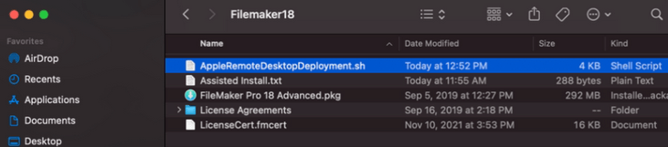

# Filemaker MDM Deployment
Mass deployment of the Filemaker MacOS app via MDM still prompts for manual upload of a license, even when supplying the LicenseCert.fmcert with the deployment.

The cause of this appears to be the official instructions for deployment are missing some info: the companion shell script that builds a .pkg -- copying of the integral license file are not pulled into the .pkg before rebuild.

Directly modifying the shell script supplied by Filemaker fixes this issue.

## Initial Setup
1. Obtain a .dmg for the version we'll be using (accessible from your license link) - this ensure the process uses "clean" files and not something that may have been modified by other users.

2. Follow the [Setting up silent assisted installations using Apple Remote Desktop (macOS)](https://fmhelp.filemaker.com/docs/18/en/fmpnisg/#install-filemaker-pro-macos_install-apple-remote-desktop-macos)
  - When you arrive at step 2 (fmp_osx_deployment.zip); download their shell script and **add the following lines**:
    - Find:
    ```bash
    cp "${root}/Assisted Install.txt" "${AppleRemoteDesktopRoot}/Assisted Install.txt"
    ```

    - Add the following, beneath:
    ```bash
    cp "${root}/LicenseCert.fmcert" "${AppleRemoteDesktopRoot}/LicenseCert.fmcert" && echo "Copied LicenseCert.fmcert"
  	cp -a "${root}/License Agreements" "${AppleRemoteDesktopRoot}/License Agreements" && echo "Copied License Agreements"
    ```

3. Put the above shell script in your custom Filemaker directory (ex. Filemaker18) -- this is stuff I extracted from a .dmg into a folder named **Filemaker18** on the desktop:
  

4. Make sure **Assisted Install.txt** has been modified, like so (along with any other options you want to enable/disable):
  ```text
  AI_LICENSEKEY=LicenseCert.fmcert
  ```

5. Run the script, like so (via terminal):
  ```bash
  cd /Users/yourusername/Desktop/Filemaker18
  ./AppleRemoteDesktopDeployment.sh /Users/yourusername/Desktop/Filemaker18
  ```

6. Example output:
  ```text
  ~/Desktop/Filemaker18 ~/Desktop/Filemaker18
  ~/Desktop/Filemaker18
  Copied LicenseCert.fmcert
  Copied License Agreements
  pkgbuild: Inferring bundle components from contents of /Users/yourusername/Desktop/Filemaker18/AppleRemoteDesktopPackage
  pkgbuild: Adding top-level postinstall script
  pkgbuild: Wrote package to /Users/yourusername/Desktop/Filemaker18/FileMaker Pro 18 Advanced ARD.pkg
```

7. In your working directory (/Users/yourusername/Desktop/Filemaker18/), a new pkg will be created: **FileMaker Pro 18 Advanced ARD.pkg** - this is the *only* file you need to give to your MDM (JAMF, Filewave, etc).  The rest of the files in your working directory can now be discarded.


:warning: The reference of **Registration.app** is obsolete as of at least Filemaker v18+

:information_source: These two issues were submitted to Claris support via email in November of 2021; hopefully these notes soon become obsolete and their script gets updated! :)
