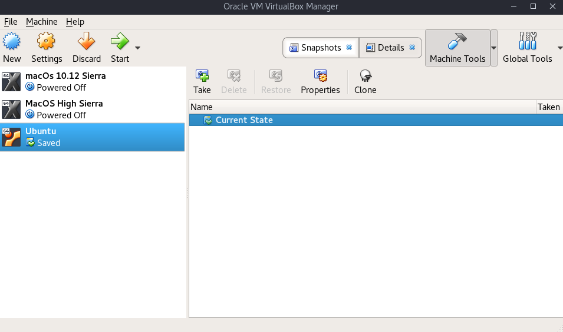
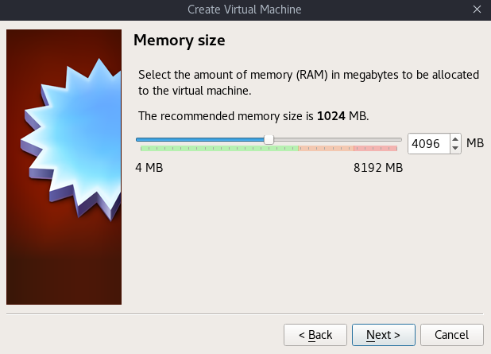
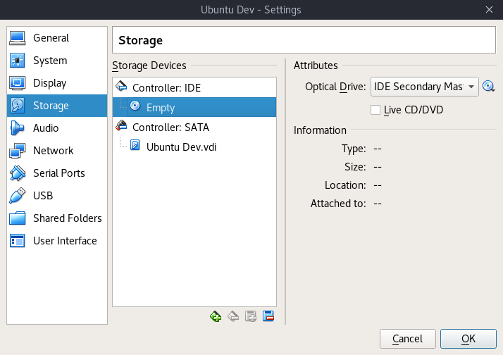

# Basic Ubuntu VirtualBox VM Setup

* First, [install VirtualBox](https://wiki.debian.org/VirtualBox#Debian_9_.22Stretch.22)

* Download an ISO image from [Ubuntu](https://www.ubuntu.com/download/desktop) to use as the virtual machine.

* Save it somewhere so it can be quickly re-provisioned for multiple machines when you decide to trash your sandbox.  I keep mine on a second hard drive under `/storage/hdd/virtualbox`

* Launch Virtualbox




* Select New > select defaults; but maximize the amount of RAM given to the guest OS, as it is released back to the host system when not in use by VirtualBox



### Attach the ISO
* Select the new Ubuntu VM in the list to highlight > click Settings on the primary menu > Storage
 - Under **Storage Devices**
 - Select Controller: IDE > Empty > on the far right of the next menu, under Attributes > Optical Drive > push the CD icon > Choose Virtual Optical Disk File > navigate to where you left the .iso file for Ubuntu and select it > hit OK and close out the menu

### Allow copy and paste from the host machine to the VirtualBox VM

* Select the new Ubuntu VM in the list to highlight > click Settings on the primary menu > General > Advanced and change the following:
 * Shared clipboard: bidirectional
 * Drag n drop: bidirectional


* Click OK, save and start the machine > proceed through the guided installation process > After reboot, it'll prompt you to remove the installation medium and hit Enter - just hit enter, since there is no installation medium.

* After you're booted up and logged in, on your keyboard, hit the key combo: **Cntrl Alt T**, to launch the terminal

* Run the following in the terminal to install the package needed to enable copy and paste:
```bash
sudo apt update && apt install virtualbox-guest-x11
```

* Once install is complete, reboot for the changes to take effect:
```bash
reboot
```

* Once you're back in, launch the terminal again: **Cntrl Alt T**

* On your host (primary PC), copy some text and go into your Ubuntu terminal and try to paste: **Cntrl Shift V**

Easy!
