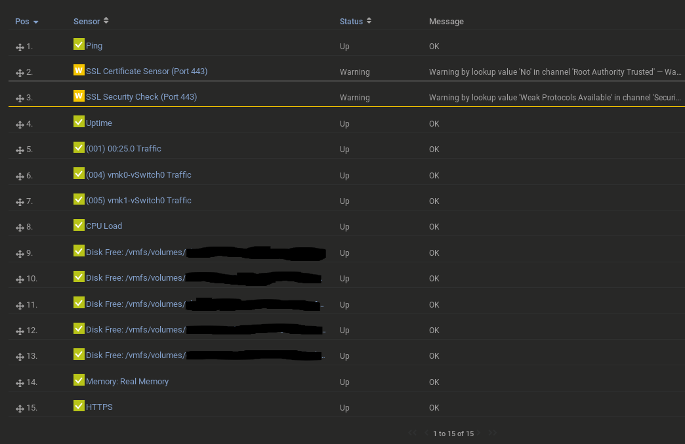

# Setup SNMP on an ESXI Host
Enable SNMP monitoring on a VMware ESXI 6.5 host.



## First, backup
Since you'll be logging into the CLI via root, you'll want a backup incase you fat finger something and crash the host.

- If SSH is not enabled, log into the host directly and enable it.  Manage > Services tab > SSH / TSM-SSH > Start
- Run the backup command:
```bash
vim-cmd hostsvc/firmware/backup_config
```
You will get output like so:
> Bundle can be downloaded at : http://*/downloads/5d4fc6f-1e4b-7470e-c45-ae6278684d11/configBundle-vmware.tgz

- In a different CLI window replace the wildcard for your hostname/host IP, download it:
```bash
cd ~/Downloads && wget http://192.168.1.2/downloads/5206ac6f-1e4b-740e-c005-ae6265454d11/configBundle-vmware.tgz --no-check-certificate
```
We use `--no-check-certificate` because without it, you will get (if using self-signed SSL certs):
> ERROR: The certificate of ‘192.168.1.2’ is not trusted.
>
> ERROR: The certificate of ‘192.168.1.2’ hasn't got a known issuer.

Now that you have a local backup, hopefully you won't need it.

## In the Host's SSH terminal

- Set the community string (I chose `public`)
```bash
esxcli system snmp set --communities public
```

- Enable the SNMP service
```bash
esxcli system snmp set --enable true
```

- Whitelist your monitoring server in the ESXI firewall (any others probing SNMP will be denied) -- my monitoring server's IP is `192.168.1.8`
```bash
esxcli network firewall ruleset set --ruleset-id snmp --allowed-all false
esxcli network firewall ruleset allowedip add --ruleset-id snmp --ip-address 192.168.1.8
esxcli network firewall ruleset set --ruleset-id snmp --enabled true
```

- Restart the SNMP service for changes to propagate
```bash
/etc/init.d/snmpd restart
```

It may take a moment, so wait:
> root: snmpd Running from interactive shell, running command: esxcli system snmp set -e false.


When it's done, you'll see:
> root: snmpd setting up resource reservations.
>
> root: snmpd opening firewall port(s) for notifications.
>
> root: snmpd watchdog for snmpd started.

- Add your ESXI host's IP to your monitoring system and you're done.

### SSH TLS Warnings
If your browser is equipped to prefer better versions of TLS than the insecure TLS1, the warnings are a non-issue and can be deleted from your sensors.

In Firefox/Waterfox:
- In the address bar:
```bash
about:config
```

- Search for:
```bash
security.tls.version.min
```
This value will tell you which version of TLS your browser will take, at minumum.
- 1 = TLS 1.0
- 2 = TLS 1.1
- 3 = TLS 1.2 (current default for most, at the time of writing)
- 4 = TLS 1.3

**security.tls.version.min** is a fallback if **security.tls.version.max** is not available.

Disabling TLS1 on an ESXI host will break compatibility with browsers that do not support more secure versions - like in legacy environments.  Not an inherent security issue; yet attempts to disable in my lab environment have to-date proven futile; [Nuthouse](http://nuthouse.us/vsphere/2018/10/07/TLSDisable.html) has a nice writeup if you want to give it a shot in your environment.
