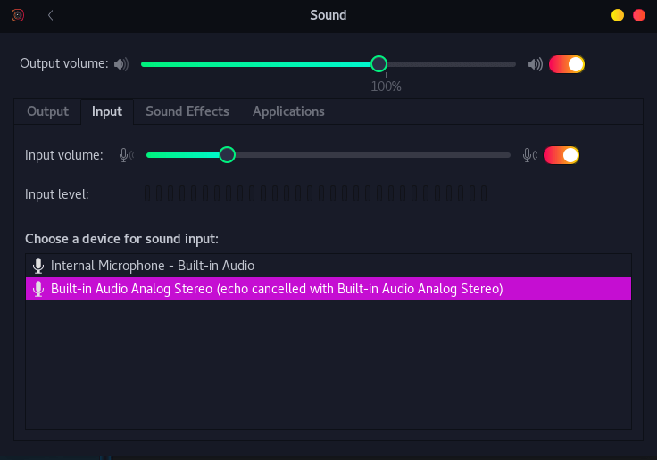

# Removing Microphone Hum on Linux Desktop
Pulseaudio in Debian doesn't appear to have noise cancellation on, by default.

I attempted to add this to `~/.config/pulse/default.pa` and Pulseaudio would crash each reboot; it appears to have to be done in the defaults of `/etc/pulse/`

First, backup:
```bash
cp /etc/pulse/default.pa /etc/pulse/default.pa.bak
```

The default back up is there, in case something goes wrong:
```text
root [~]: ls -l /etc/pulse
total 28
-rw-r--r-- 1 root root 1201 Jun 18  2017 client.conf
-rw-r--r-- 1 root root 2305 May  7  2018 daemon.conf
-rw-r--r-- 1 root root 4998 Apr 15 14:45 default.pa
-rw-r--r-- 1 root root 4929 Apr 15 14:45 default.pa.bak
-rw-r--r-- 1 root root 2046 Jun 18  2017 system.pa
```

Stop Pulseaudio (run as your user, not root/sudo):
```bash
pulseaudio -k
```
Worth noting: Any applications dependent on sound will lose it, until they too, are restarted.

Edit default.pa:
```bash
pico /etc/pulse/default.pa
```

Append the following, to the bottom of the file:
```bash
# noise canceling
load-module module-echo-cancel aec_method=webrtc
```

In some cases you can restart Pulseaudio, but it didn't take effect for me until a system reboot. (Run as user, not root/sudo):
```bash
pulseaudio --start
```

After a reboot, I had to go to system Settings and select the new input profile that was created:


If it hasn't improved noticeably, the [Arch wiki](https://wiki.archlinux.org/index.php/PulseAudio/Troubleshooting) has a thorough list of arguments that can be appended to `aec_args`.
